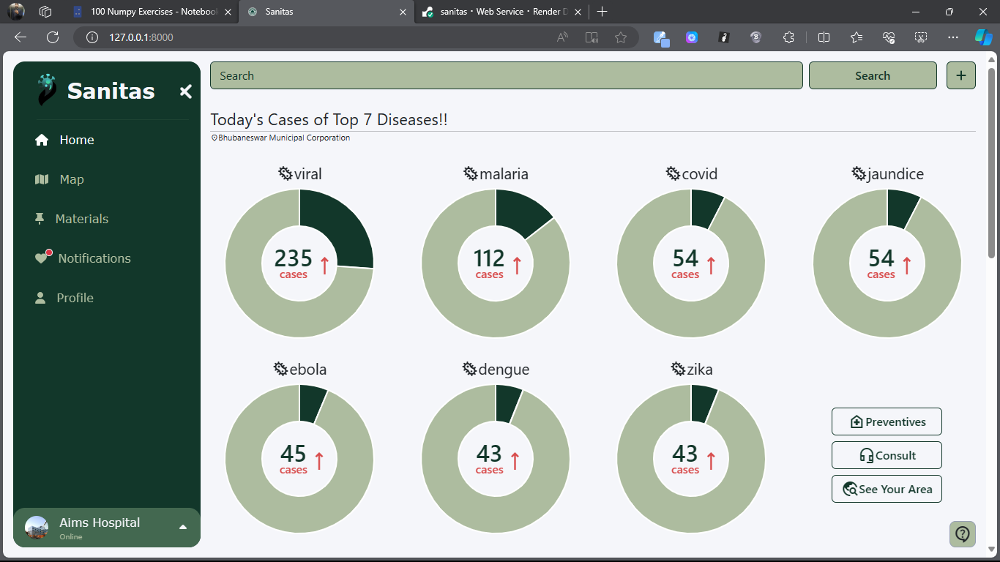
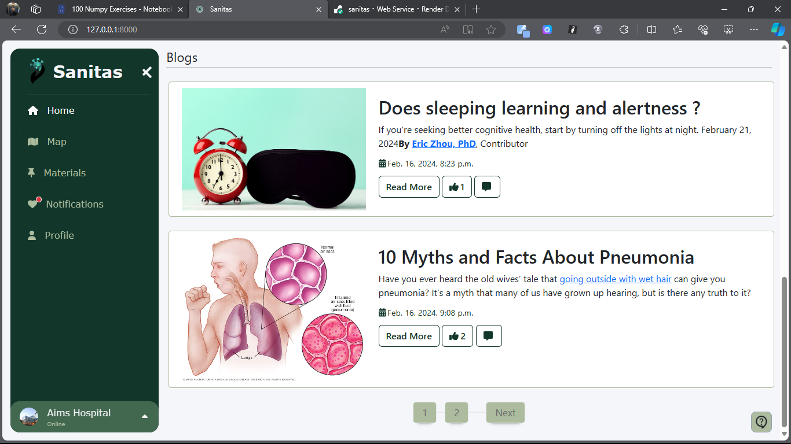
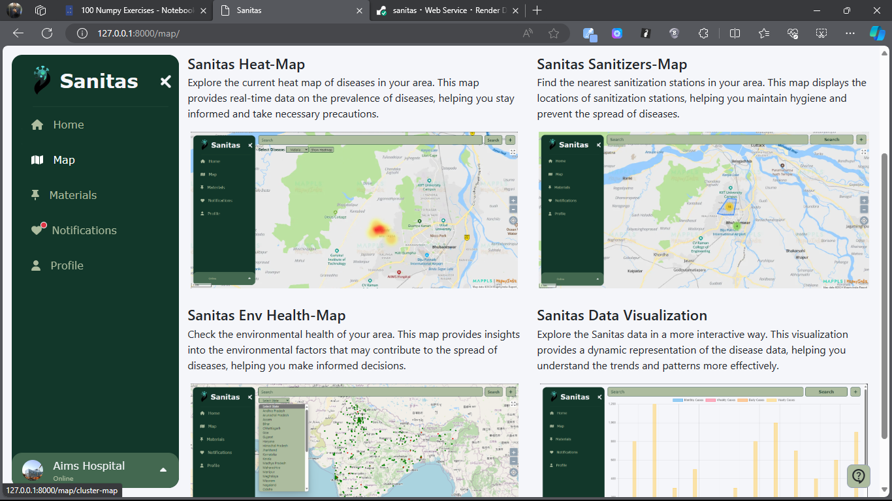

# Problems

> * Diseases, accidents, Drugs-cases whatever can affect our future and present we are unable to get any pre alerts.

> * What if we will be able to know trendy Diseases severity in our locality, City, state or in country is not that fascinating?

> * What if government will be able to know what type of accidental injuries happening in our surrounding in a city, state or a specific area so that they can work on that?

> * What if police will be able to know which city using Drugs and getting affected by those a lot so that they can work on that?

> * What if we will be able to predict any disease spreading and what if we will be able to stop any pandemic, epidemic or any severe unknown disease.

# Solution

> **Sanitas**.... ***A healthcare web application*** which is capable in giving the information of trendy **disease in last 24 hour.** It provides a simplified record of active daily diseases around you using maps, graphs, charts and other **data visualization techniques**. With this data, **we can predict pandemics, epidemics, and contagious diseases**. Whats more, we can even predict diseases that may arise in a place in advance and **help people improve their health** and save lives by taking appropriate measures. We can also implement for the **accidents and drugs cases in our surrounding** so that we will be able to get aware from the disease as well as injuries and drugs affected people nearby us so that government or related authorities can take proper actions on those, And **all those data we will collect from the hospitals, clinics, pathology and many other bodies which can improve the healthcare system.**

# Benifits

> * Early detection and prevention of diseases, accidents, and drug-related issues can benefit all members of the community, promoting a healthier and safer environment.
> * we can even predict diseases that may arise in a place in advance and help people improve their health and save lives by taking appropriate measures.
> * This early awareness fosters a culture of health consciousness and can lead to positive environmental changes like opting for active transportation or consuming organic produce.
> * Sanitas potential to predict outbreaks allows authorities to proactively allocate resources and implement preventative measures, potentially mitigating epidemics and pandemics.
> * This comprehensive approach to disease awareness promotes community inclusion and empowers individuals to take charge of their health, ultimately creating a healthier and more resilient society.

# What different

> While initiatives like iHIP and IDSP play a crucial role in disease surveillance in india, Sanitas takes a different approach.

> It focuses on empowering the general public with real-time disease information through a user-friendly web application. Sanitas utilizes clear data visualization to make disease trends accessible to everyone, unlike  technical reports often used in existing programs. Additionally, Sanitas has the potential to predict outbreaks, fostering a more proactive approach to public health.

> Finally, Sanitas prioritizes transparency and accessibility, making disease information readily available to the entire community.

### *Sample look of the sanitas*

